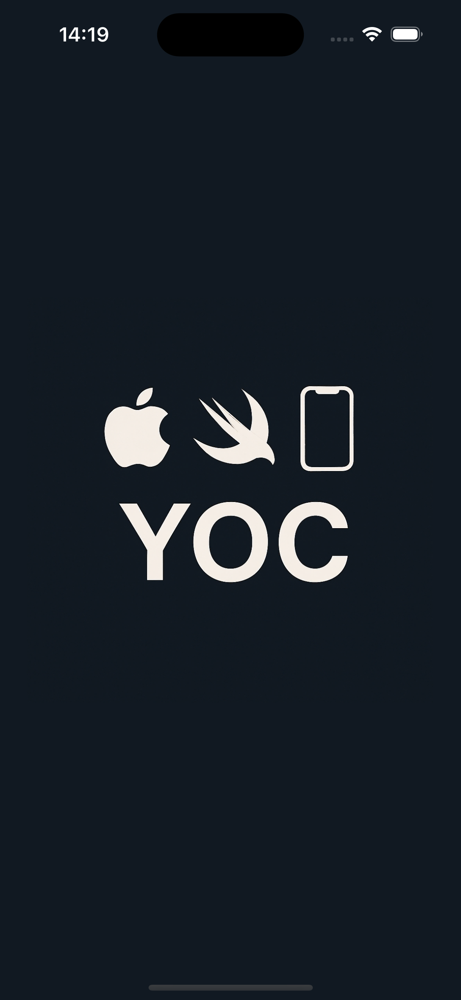
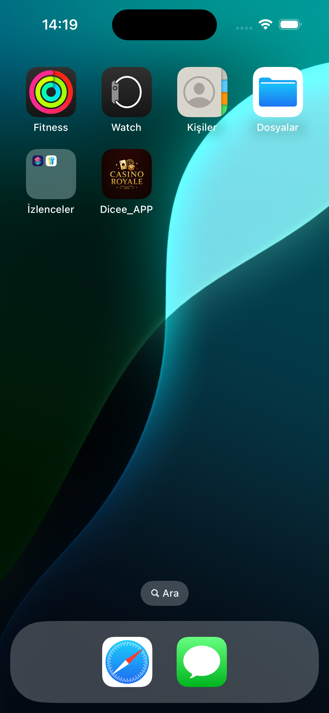
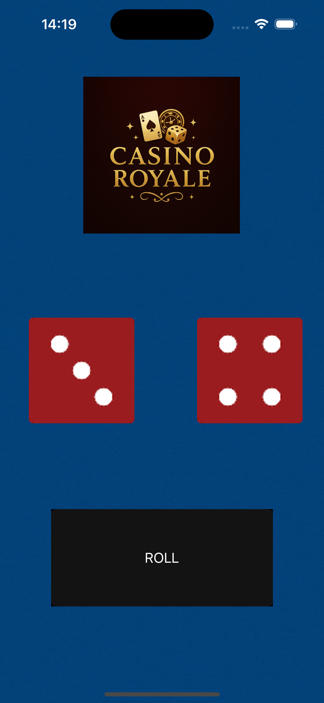

# 🎲 Dicee App – Casino Style

A simple dice rolling app built with Swift and UIKit. Inspired by the classic casino look, it features clean UI and smooth dice animations.

## Features

- 🎰 Casino-style theme  
- 🎲 Random dice roll  
- 🧪 Built with Swift & UIKit  
- 📱 Optimized for iOS

## Screenshots

  

## Run It

1. Clone the repo  
2. Open in Xcode  
3. Run on Simulator or real device

## Author

**Yavuz** – iOS Developer
